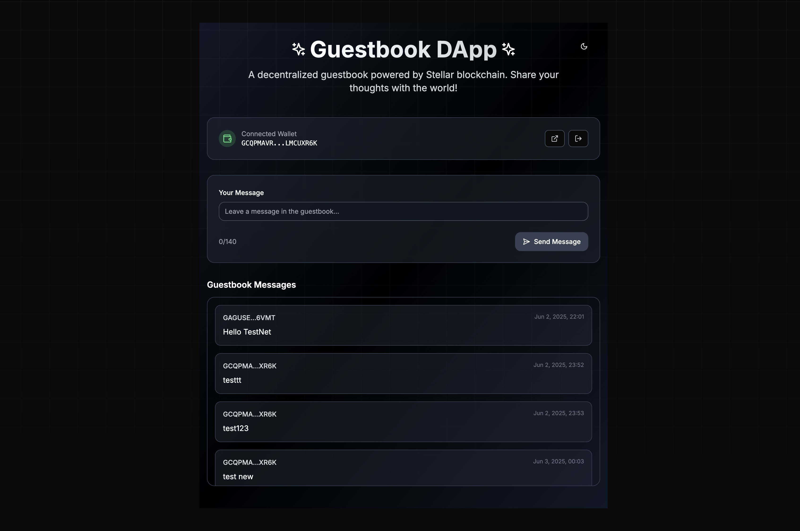
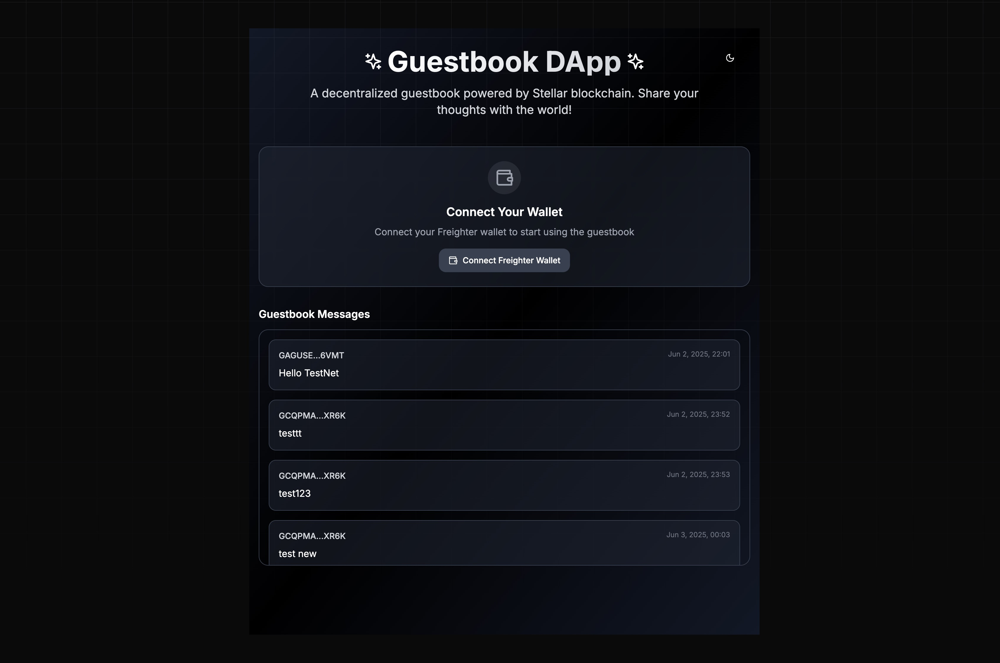

# 🌟 Stellar Guestbook DApp

> **A modern guestbook application running on the Stellar blockchain**

[](https://nextjs.org/)
[](https://www.typescriptlang.org/)
[](https://stellar.org/)
[](https://tailwindcss.com/)

## 📖 About

Stellar Guestbook DApp is a modern web3 application where users can connect their Freighter wallets and leave messages on the blockchain. This project is an excellent starting point for those who want to get familiar with the Stellar ecosystem and Soroban smart contracts.

## ✨ Features

- 🔗 **Freighter Wallet Integration** - Secure wallet connection
- 💬 **Message System** - Leave permanent messages on blockchain
- 🎨 **Modern UI/UX** - Elegant design with Tailwind CSS
- 🌙 **Dark/Light Mode** - Theme switching support
- 📱 **Responsive Design** - Mobile-friendly interface
- ⚡ **Framer Motion Animations** - Smooth transitions
- 💾 **LocalStorage Persistence** - Page refresh resistance
- 🔍 **TypeScript** - Type safety
- 🚀 **Real Blockchain Integration** - Connected to Stellar TestNet

## 🚀 Quick Start

### ⚙️ Prerequisites

Before running the project, make sure you have the following tools installed on your system:

- **Node.js** (v18.0 or higher) - [Download](https://nodejs.org/)
- **npm** or **yarn** - Comes with Node.js
- **Git** - [Download](https://git-scm.com/)
- **Freighter Wallet** Extension - [Add to Chrome/Firefox](https://freighter.app)

### 📥 Installation

1. **Clone the project**

   ```bash
   git clone https://github.com/mertcansulupinar/stellar-guestbook-dapp.git
   cd stellar-guestbook-dapp
   ```

2. **Install dependencies**

   ```bash
   npm install
   # or if you use yarn
   yarn install
   ```

3. **Start the development server**

   ```bash
   npm run dev
   # or
   yarn dev
   ```

4. **Open in browser**

   Go to http://localhost:3000

### 🦊 Freighter Wallet Setup

1. **Install the extension**

   - Go to [freighter.app](https://freighter.app)
   - Click "Download for Chrome" or "Download for Firefox"
   - Add the extension to your browser

2. **Create a wallet**

   - Click on the Freighter extension
   - Select "Create new wallet"
   - Create a strong password
   - Store your seed phrase in a safe place

3. **Switch to Testnet**

   - Click the settings (⚙️) icon in Freighter
   - Select "Testnet" from the "Network" section

4. **Get test XLM**
   - Go to [Stellar Laboratory](https://laboratory.stellar.org/#account-creator)
   - Make sure "Testnet" is selected
   - Enter your public key (copy from Freighter)
   - Click "Get test network lumens"

## 🌐 Live Demo

🚀 **[Visit Live Application](https://gb.mertcansulupinar.com)**

### Contract Information

- **Network**: Stellar TestNet
- **Contract ID**: `CD5HAABXEFWUTSQKYZI37SQBWU4BPRQL7Y6DWTB5SZLHNG52VIDJFYYM`
- **Explorer**: [View on Stellar Expert](https://stellar.expert/explorer/testnet/contract/CD5HAABXEFWUTSQKYZI37SQBWU4BPRQL7Y6DWTB5SZLHNG52VIDJFYYM)

## 🏗️ Production Build

To create an optimized build for production:

```bash
# Create build
npm run build

# Test the build
npm start
```

### 🚀 Deployment

#### Deploy with Vercel (Recommended)

1. **Connect your GitHub repo to Vercel**

   - Go to [vercel.com](https://vercel.com)
   - Sign in with your GitHub account
   - Click "New Project"
   - Select your repo

2. **Deploy settings**

   - Framework Preset: **Next.js**
   - Root Directory: **/**
   - Build Command: `npm run build`
   - Output Directory: `.next`

3. **Deploy**
   - Click "Deploy" button
   - Automatically deploys

#### Deploy with Netlify

1. **Prepare build folder**

   ```bash
   npm run build
   npm run export
   ```

2. **Create new site on Netlify**
   - Go to [netlify.com](https://netlify.com)
   - Click "New site from Git"
   - Select your GitHub repo

#### Deploy with Docker

```dockerfile
# Dockerfile
FROM node:18-alpine

WORKDIR /app
COPY package*.json ./
RUN npm ci --only=production
COPY . .
RUN npm run build

EXPOSE 3000
CMD ["npm", "start"]
```

```bash
# Docker build & run
docker build -t stellar-guestbook .
docker run -p 3000:3000 stellar-guestbook
```

## 🏗️ Project Structure

```
stellar-guestbook-dapp/
├── app/                    # Next.js App Router
│   ├── layout.tsx         # Main layout
│   ├── page.tsx           # Main page
│   └── globals.css        # Global styles
├── components/            # React components
│   ├── ui/               # Base UI components (shadcn/ui)
│   ├── guestbook-app.tsx # Main application component
│   ├── wallet-connection.tsx # Wallet connection
│   ├── guestbook-form.tsx    # Message form
│   ├── guestbook-entries.tsx # Message list
│   └── theme-toggle.tsx      # Theme switcher
├── lib/                   # Helper libraries
│   ├── stellar-service.ts # Stellar integration
│   ├── config.ts         # Configuration
│   └── utils.ts          # General helpers
├── hooks/                # Custom React hooks
├── public/              # Static files
├── .gitignore          # Git ignore rules
├── package.json        # NPM dependencies
├── tailwind.config.js  # Tailwind configuration
└── tsconfig.json       # TypeScript configuration
```

## 🛠️ Technology Stack

### Frontend

- **Next.js 14** - React framework with App Router
- **TypeScript** - Type safety
- **Tailwind CSS** - Utility-first CSS framework
- **shadcn/ui** - Modern UI component library
- **Framer Motion** - Animation library
- **React Hook Form + Zod** - Form management and validation

### Blockchain

- **Stellar SDK** - Stellar blockchain interaction
- **Soroban** - Smart contract platform
- **Freighter API** - Wallet integration
- **TestNet** - Development network

### Development Tools

- **ESLint** - Code linting
- **Prettier** - Code formatting
- **PostCSS** - CSS processing
- **Autoprefixer** - CSS vendor prefixes

## 🔧 Configuration

### Environment Variables

Create a `.env.local` file in the root directory:

```env
# Stellar Configuration
NEXT_PUBLIC_STELLAR_NETWORK=testnet
NEXT_PUBLIC_RPC_URL=https://soroban-testnet.stellar.org
NEXT_PUBLIC_CONTRACT_ID=CD5HAABXEFWUTSQKYZI37SQBWU4BPRQL7Y6DWTB5SZLHNG52VIDJFYYM
```

### Contract Configuration

The application is configured to use the deployed TestNet contract. To use your own contract:

1. Deploy your Soroban contract to TestNet
2. Update the `CONTRACT_ID` in `lib/config.ts`
3. Ensure your contract implements the same interface

## 🧪 Development

### Local Development

```bash
# Start development server
npm run dev

# Run linting
npm run lint

# Format code
npm run format

# Type checking
npm run type-check
```

### Testing

```bash
# Run tests (when added)
npm run test

# Run tests in watch mode
npm run test:watch
```

## 📚 Smart Contract

The Soroban smart contract is written in Rust and implements:

- `add_message(sender: Address, message: String)` - Add a new message
- `get_messages()` - Retrieve all messages

### Contract Features

- ✅ Message storage on blockchain
- ✅ Sender verification
- ✅ Timestamp tracking
- ✅ Message retrieval
- ✅ Gas-optimized operations

## 🤝 Contributing

Contributions are welcome! Please feel free to submit a Pull Request.

### Development Process

1. Fork the repository
2. Create your feature branch (`git checkout -b feature/AmazingFeature`)
3. Commit your changes (`git commit -m 'Add some AmazingFeature'`)
4. Push to the branch (`git push origin feature/AmazingFeature`)
5. Open a Pull Request

## 📄 License

This project is licensed under the MIT License - see the [LICENSE](LICENSE) file for details.

## 🔗 Useful Links

- [Stellar Documentation](https://developers.stellar.org/)
- [Soroban Documentation](https://soroban.stellar.org/)
- [Freighter Wallet](https://freighter.app/)
- [Next.js Documentation](https://nextjs.org/docs)
- [Tailwind CSS](https://tailwindcss.com/)

## ⭐ Support

If this project helped you, please give it a ⭐ on GitHub!

## 📸 Screenshots

### Wallet Connected State



### Message Submission Interface



## 📞 Contact

- **Developer**: Mert Can SULUPINAR
- **Website**: [https://mertcansulupinar.com/](https://mertcansulupinar.com/)
- **GitHub**: [@mertcansulupinar](https://github.com/mertcansulupinar)
- **Project Link**: [https://github.com/mertcansulupinar/stellar-guestbook-dapp](https://github.com/mertcansulupinar/stellar-guestbook-dapp)

---

<div align="center">
  
**Made with ❤️ using Stellar & Next.js**

</div>
